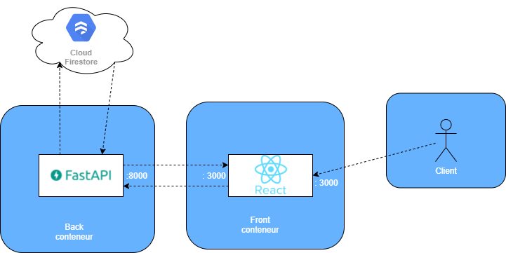

<!-- START doctoc generated TOC please keep comment here to allow auto update -->
<!-- DON'T EDIT THIS SECTION, INSTEAD RE-RUN doctoc TO UPDATE -->
**Table of Contents**  *generated with [DocToc](https://github.com/thlorenz/doctoc)*

- [Digikofy Front Back](#digikofy-front-back)
  - [Concernant ce projet](#concernant-ce-projet)
  - [Pour le lancer](#pour-le-lancer)
  - [API](#api)
    - [Routes disponibles](#routes-disponibles)
  - [Application React.js](#application-reactjs)
    - [Routes accessibles](#routes-accessibles)

<!-- END doctoc generated TOC please keep comment here to allow auto update -->

# Digikofy Front Back


## Concernant ce projet

Ce projet a été réalisé à l'aide de React.js pour le front, Python à l'aide de la librairie FastAPI. Il est possible de se créer un compte ensuite de se
connecter pour avoir accès à une liste de cafés où l'on pourra accéder au detail de chacun.

### Architecture





### Schema Base de Données NoSQL


## Pour le lancer

Pour lancer ce projet, ayant utilisé docker-compose pour faciliter le deploiement de cette application. Pour lancer le projet il suffit d'avoir installé docker, de pull le projet et taper la commande suivante à la racine où se trouve le docker-compose.yml :

```bash
    docker-compose up
```

Il y a aussi la possibilité de récupérer les images séparément sur le docker hub avec les liens ci-dessous :

Back : https://hub.docker.com/repository/docker/kevintsi/digikofy-back

Front https://hub.docker.com/repository/docker/kevintsi/digikofy-front

Lors du lancement de l'API, vous aurez un appel à l'API toutes les 30 secondes pour vérifier la santé du conteneur 

```bash

digikofy-back-container | INFO:     127.0.0.1:36012 - "GET / HTTP/1.1" 200 OK
digikofy-back-container | INFO:     127.0.0.1:36016 - "GET / HTTP/1.1" 200 OK
digikofy-back-container | INFO:     127.0.0.1:36024 - "GET / HTTP/1.1" 200 OK
digikofy-back-container | INFO:     127.0.0.1:36034 - "GET / HTTP/1.1" 200 OK
digikofy-back-container | INFO:     127.0.0.1:36036 - "GET / HTTP/1.1" 200 OK
digikofy-back-container | INFO:     127.0.0.1:36042 - "GET / HTTP/1.1" 200 OK
digikofy-back-container | INFO:     127.0.0.1:36046 - "GET / HTTP/1.1" 200 OK

```

Cependant cela peut être désactiver en commentant 
dans le fichier docker-compose.yml la ligne ci-dessous :

```yml

    healthcheck:
      test: curl --fail -s http://localhost:8000/ || exit 1
      interval: 30s
      timeout: 10s
      retries: 3
```

## API

### Routes disponibles 


**index() :** 

***Route :*** "/"

***Méthode :*** GET

***Action :*** Retourne un JSON avec un message indiquant que le projet s'est lancé sans problème

-------------

**get_coffees() :** 

***Route :*** "/coffees"

***Méthode :*** GET

***Action :*** Retourne tous les cafés

-------------

**get_coffee() :** 

***Route :*** "/coffee/{id}"

***Méthode :*** GET

***Action :*** Retourne le café ayant l'id passé dans la route

-------------

**login() :** 

***Route :*** "/login"

***Méthode :*** POST

***Body :***

***- email : string***

***- password : string***

***Action :*** Verifie si un utilisateur existe avec l'email et le mot de passe entré, s'il existe renvoie un token sinon renvoie un code 404

-------------

**register() :** 

***Route :*** "/register"

***Méthode :*** POST

***Body :***

***- email : string***

***- password : string***

***Action :*** Verifie si un utilisateur avec cet email n'existe pas déjà si oui renvoie 409 si non, alors il ajoute l'utilisateur à la base de données

---------------


**refresh_token() :** 

***Route :*** "/refreshToken"

***Méthode :*** POST

***Body :***

***- refresh_token : string***

***Action :*** Verifie si le refresh token ne se trouve pas dans la liste noire des refresh token, si oui alors il créer et renvoie un nouveau token à partir de ce refresh token

-----------------


**revoke() :** 

***Route :*** "/revoke"

***Méthode :*** POST

***Body :***

***- refresh_token : string***

***Action :*** Ajoute le refresh token dans la liste noire


## Application React.js


### Routes accessibles


**Route :** "/register"

***Action :*** Affiche le formulaire d'inscription

**Route :** "/login"

***Action :*** Affiche le formulaire de connexion

**Route :** "/home"

***Action :*** Affiche la liste de cafés

**Route :** "/detail/{id}"

***Action :*** Affiche le détail du café ayant pour id celui passé dans la route


